# CMPE 172 - Lab #10 Notes by Siya Bedi

## CI Workflow (Part 1)

### Navigated to "Actions" and created a new workflow:
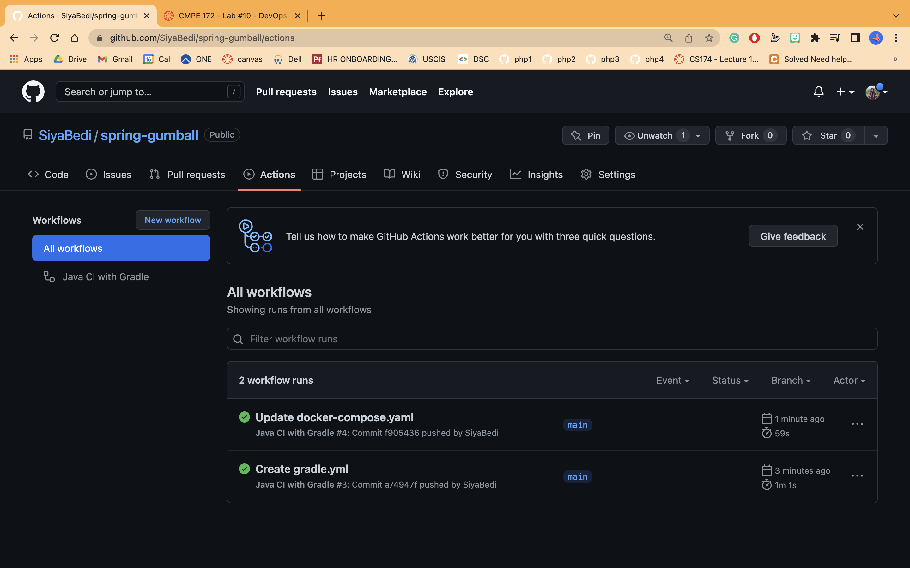

### I made a commit to the docker-compose.yaml to trigger the action
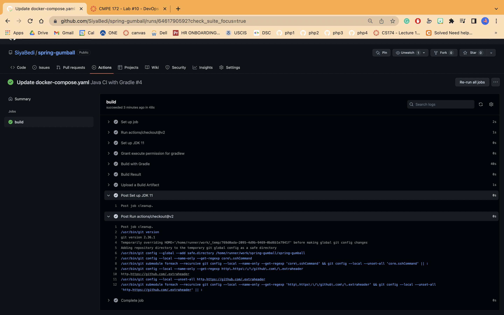

## CD Workflow (Part 2)

### GCP Service Accoucnt & JSON Service Account Key
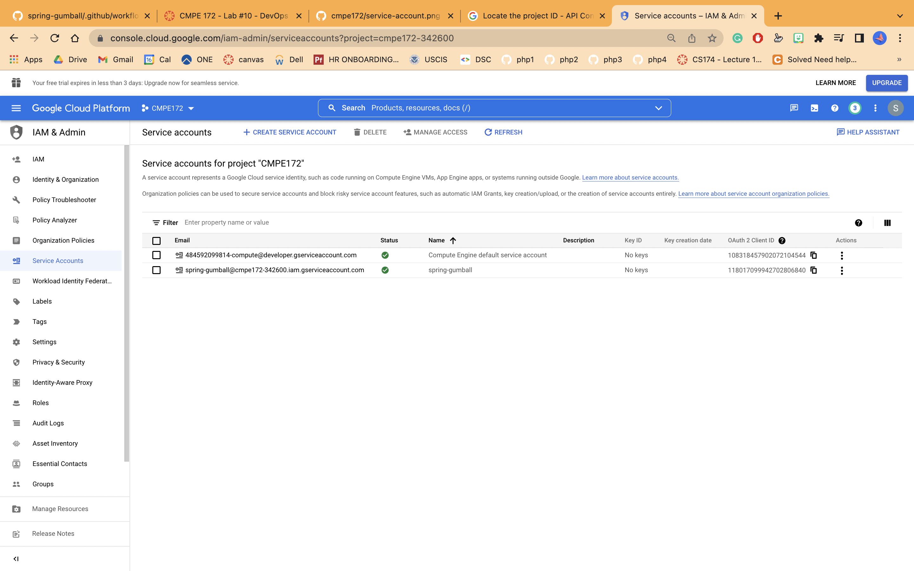
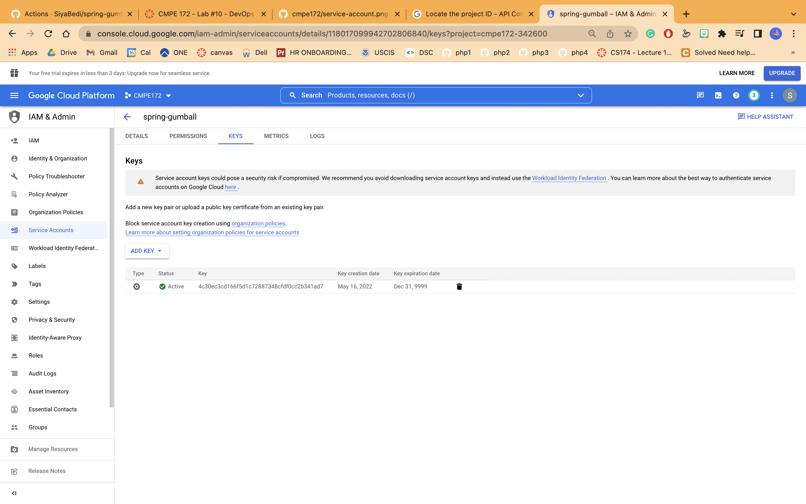

### GitHub Action Secrets
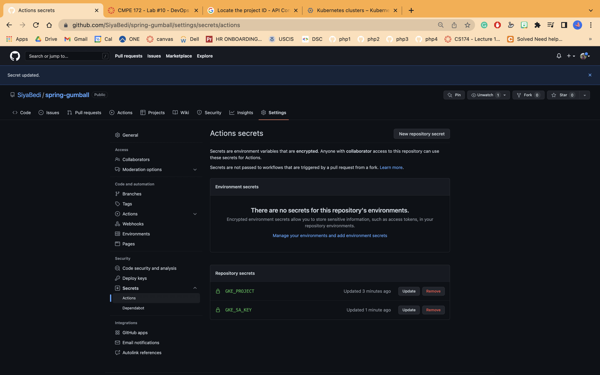

## Trigger a CD Deployment by creating a new GitHub Release

### Created cluster
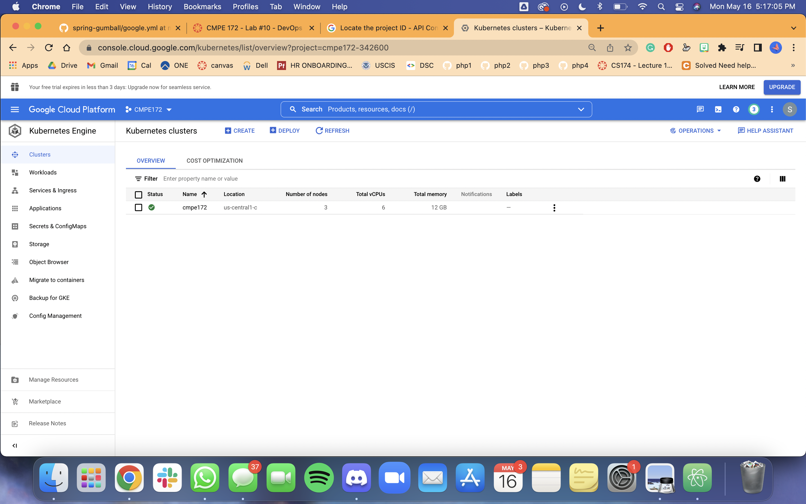

### Create Release
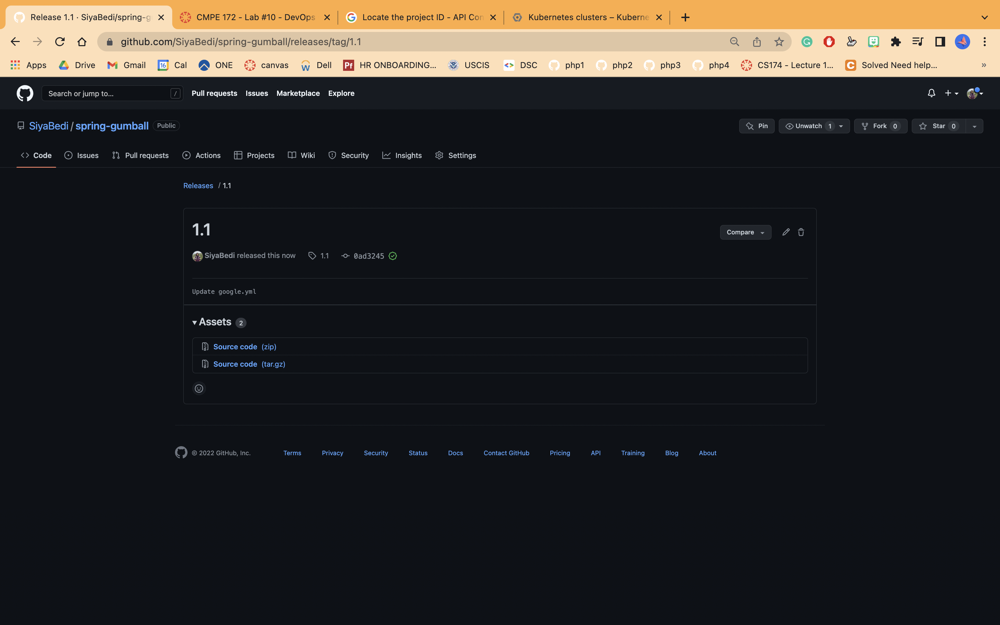

### Release success
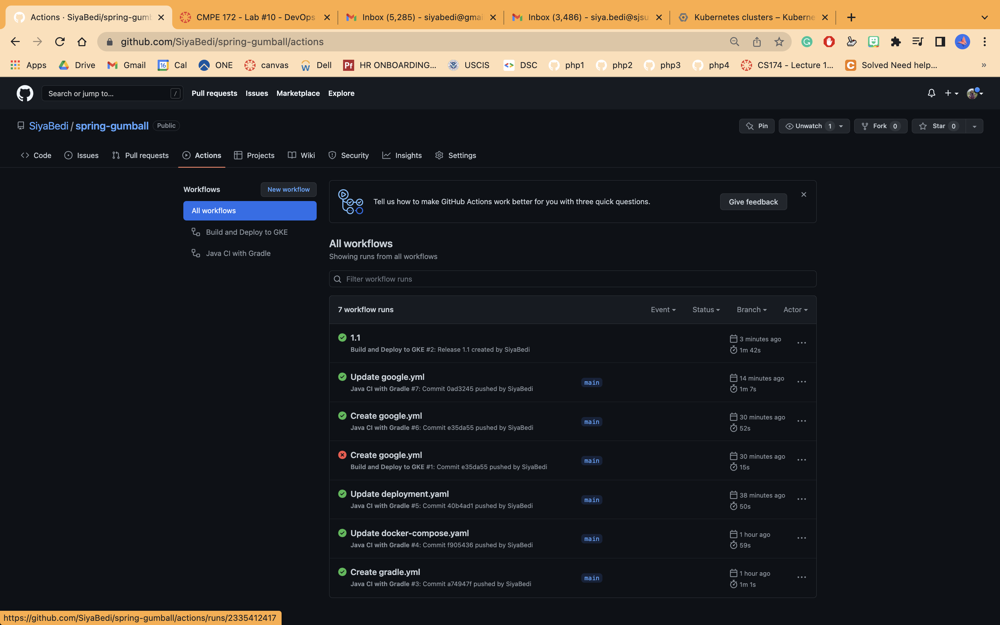

### Workload
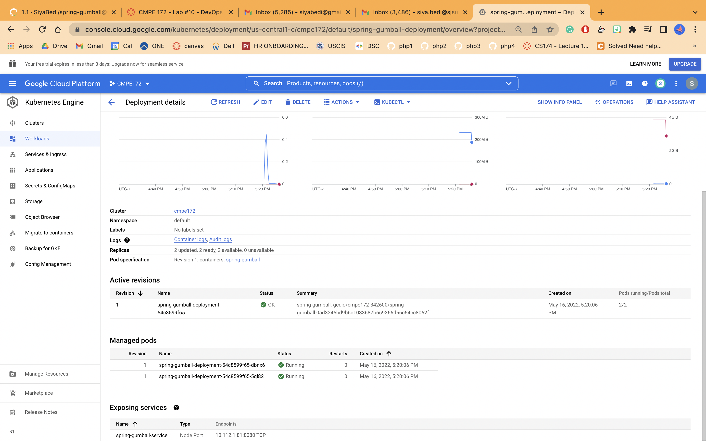

### Services
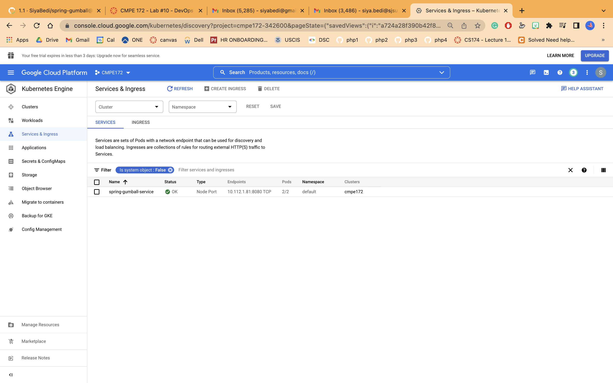

### Creating Ingress
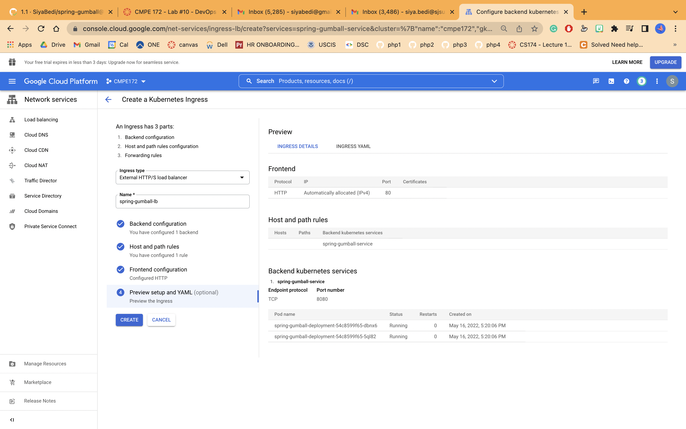

### Successful Ingress
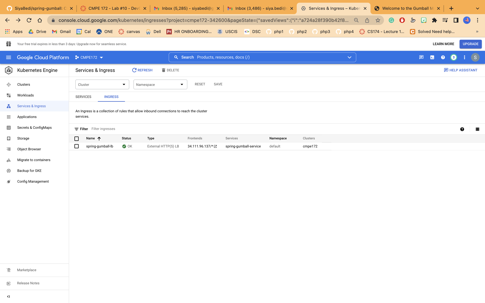

### Proof of success
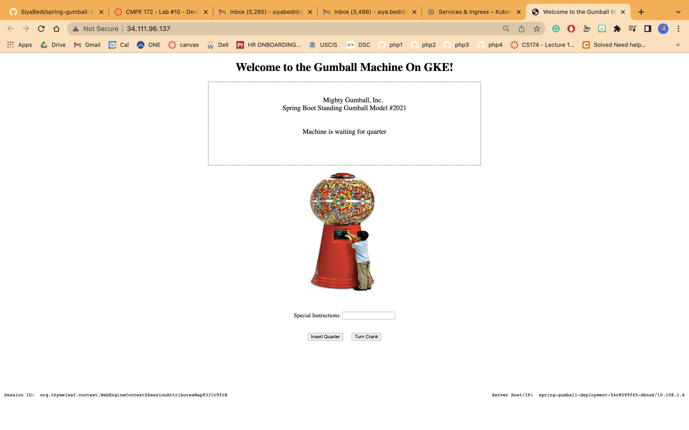

